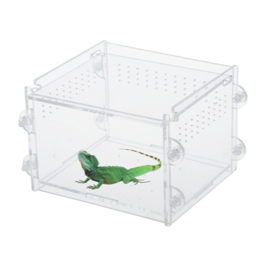

# chi-in-a-box

CHI-in-a-box is a packaging of the implementation of the core services that together constitute the Chameleon testbed for experimental Computer Science research. These services allow Chameleon users to discover information about Chameleon resources, allocate those resources for present and future use, configure them in various ways, and monitor various types of metrics.

## Currently included with CHI-in-a-Box:

- Custom OpenStack deployment optimized for bare metal reservations and provisioning, including the following OpenStack services by default:
  - Ironic
  - Nova (with custom vendordata service for automatic experiment metrics collection)
  - Neutron (and Neutron FWaaS)
  - Glance
  - Gnocchi
  - Keystone
  - Heat
- Experiment Precis
- JupyterHub with Keystone integration
- HA-ready setup using HAProxy/keepalived for redundancy (requires multi-node deployment)
- Prometheus monitoring and custom operational alerts
- Centralized searchable system logs
- Automated backups of important data (Glance images, Gnocchi metrics, MySQL databases)

## Currently _not_ included:

- User/project management: user database integration with Keystone can be accomplished in a number of ways. It is left up to the implementor of the independent testbed how to set this up. Chameleon Associate sites will be directly integrated with the existing Chameleon user management portal by Chameleon operators.
- Usage enforcement: while Chameleon comes with usage reporting, the enforcement of usage based on allocations is something that is provided only at best-effort by CHI-in-a-Box. There is no permanent storage of allocations in CHI-in-a-Box, neither is there allocation management or the ability to renew or review allocation requests.
