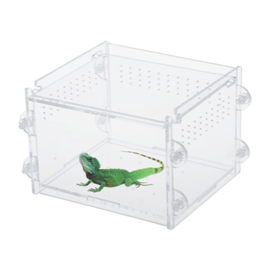

# What is CHI-in-a-Box?

CHI-in-a-box is a packaging of the core services that together constitute the [Chameleon](https://www.chameleoncloud.org) testbed for experimental Computer Science research. These services allow Chameleon users to discover information about Chameleon resources, allocate those resources for present and future use, configure them in various ways, and monitor various types of metrics.

While a large part of CHI (**CH**\ ameleon **I**\ nfrastructure) is based on an open source project (OpenStack), and all the extensions we made are likewise open source, without proper packaging there was no clear recipe on how to combine them and configure a testbed of this type. CHI-in-a-box is composed of the following three components:

1. open source dependencies supported by external projects (e.g., OpenStack and Grid’5000)
2. open source extensions made by the Chameleon team, both ones that are scheduled to be integrated into the original project (but have not been yet) and ones that are specific to the testbed
3. new code written by the team released under the Apache License 2.0.

## Who is it for?

We have identified demand for three types of scenarios in which users would like to use a packaging of Chameleon infrastructure:

### **Chameleon Associate**

In this scenario a provider wants to add resources to the Chameleon testbed such that they are discoverable and available to all Chameleon users while retaining their own project identity (via branding, usage reports, some of the policies, etc.). This type of provider will provide system administration of their resources (hardware configuration and operation as well as CHI administration with the support of the Chameleon team) and use the Chameleon user services (user/project management, etc.), user portal, resource discovery, and appliance catalog. All user support will be provided by the Chameleon team.

### **Chameleon Part-time Associate**

This scenario is similar to the Chameleon Associate but while the resources are available to the testbed users most of the time, the provider anticipates that they may want to take them offline for extended periods of time for other uses. In this scenario Chameleon support extends only to the time resources are available to the testbed.

### **Independent Testbed**

In this scenario a provider wants to create a testbed that is in every way separate from Chameleon. This type of provider will use CHI for the core testbed services only and operate their user services (i.e., manage their own user accounts and/or projects, help desk, mailing lists and other communication channels, etc.), user portal, resource discovery, and appliance catalog (some of those services can in principle be left out at the cost of providing a less friendly interface to users). This scenario will be supported on a best effort basis only.

## Currently included with CHI-in-a-Box:

**For users**: A full-featured cloud deployment optimized for bare metal reservations and provisioning, including the following OpenStack services by default:

* Ironic (bare metal deployment)
  * Including support for bare metal snapshots (not yet an OpenStack-provided capability)
* Blazar (advanced reservation for resources such as bare metal nodes and public IP addresses or layer-2 circuits)
* Nova (instance deployment in conjunction w/ Ironic)
  * Including custom vendordata service for automatic experiment metrics collection
* Neutron (networking)
* Glance (disk image storage)
* Gnocchi (timeseries storage for experiment metrics)
* Keystone (authentication and authorization)
* Heat (orchestration)

Chameleon additionally provides a few useful extra pieces for all users of CHI-in-a-Box associate sites:

* Integration with the [Chameleon shared Jupyter environment](https://chameleoncloud.readthedocs.io/en/latest/technical/jupyter.html), to allow orchestrating experiments via Jupyter notebooks.
* [Experiment Precis](https://chameleoncloud.readthedocs.io/en/latest/technical/ep.html) provides automatic environment capture for documentation and reproducibility.
* Login with existing host credential accounts--no need to create another account or password to access Chameleon infrastructure. Take one account and use it on any Chameleon site.

**For operators**: A suite of additional tools to help you administer your testbed with confidence "as cheaply as possible."

* [Prometheus](https://prometheus.io) monitoring and custom operational alerts, for insight into overall system health.
* [Centralized searchable system logs](https://docs.openstack.org/kolla-ansible/latest/reference/logging-and-monitoring/central-logging-guide.html) with Kibana visualizations, for when you need to find something specific.
* [Hammers](https://github.com/chameleoncloud/hammers): automated sanity checks and maintenance scripts, for those inevitable yet easily fixable issues.
* HA-ready setup using HAProxy/keepalived for redundancy, for when uptime is a primary concern (requires multi-node deployment).
* Automated backups of important data (Glance images, MySQL databases), for a better night's rest.
* Integrate with Chameleon's existing user and allocation management system to remove the need to operate your own user workflow, authentication, and authorization systems.

## Currently _not_ included:

* ~~Integration with Chameleon federated identity~~ (**added February 2021!**)
* ~~Track and limit usage of resources via Chameleon's allocation management system~~ (**added February 2021!**)
* Support for deploying a KVM cloud or hybrid bare metal/KVM cloud infrastructure. While this is possible (and currently powers the [Chameleon KVM cloud](https://chameleoncloud.readthedocs.io/en/latest/technical/kvm.html)), this capability is still in early testing and not yet officially supported.
* Storage cluster provisioning. It's assumed that, if you desire integration with a storage system (e.g., Ceph), it is preconfigured. Such storage systems can however be integrated with a CHI-in-a-Box site to provide persistence for disk images and experiment metrics.
* Remote block storage integration for bare metal. All bare metal nodes will utilize local storage only. See the [Hardware requirements](https://github.com/ChameleonCloud/chi-in-a-box/wiki/Hardware-requirements) page for more information on what kinds of bare metal hardware configurations are currently supported.

We hope the above list continues to shrink ;)
