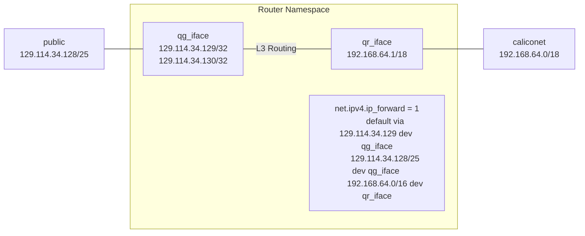
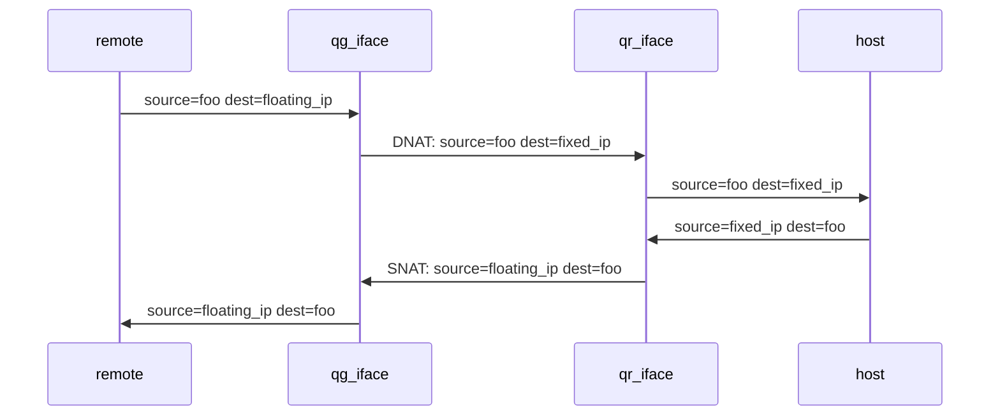
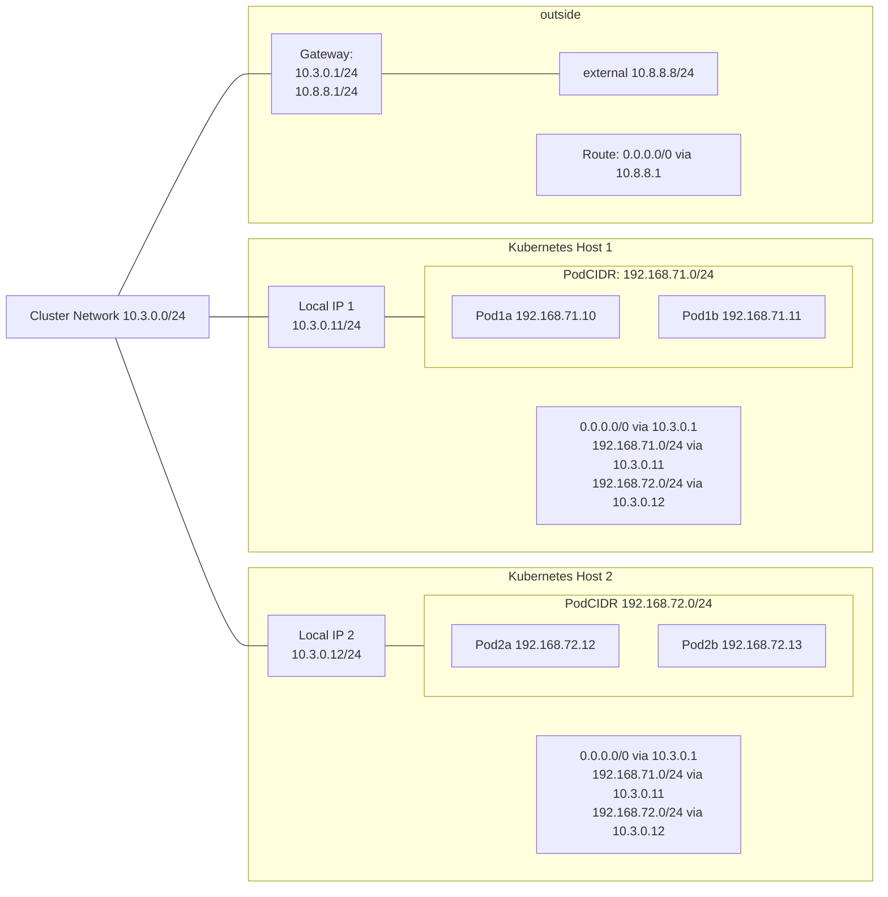
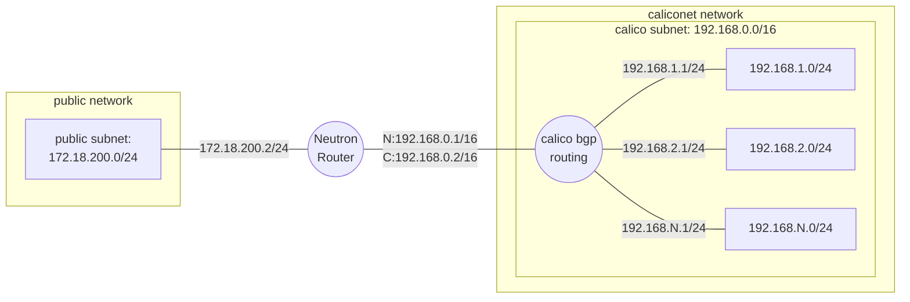
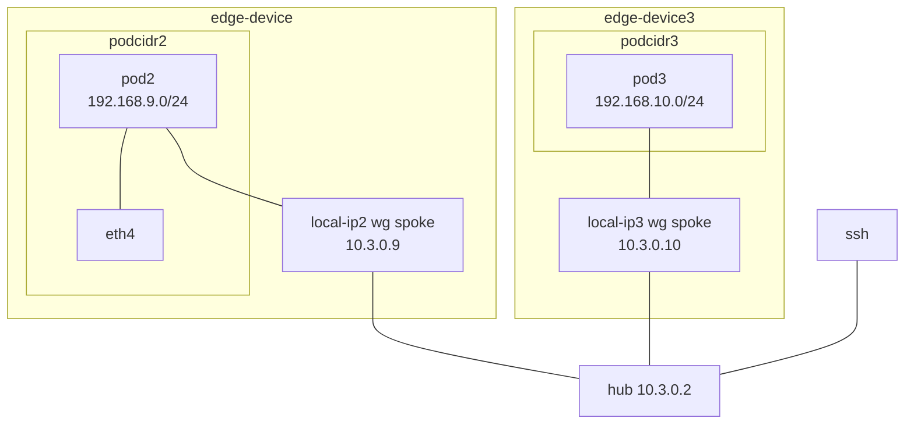

# CHI@Edge Networking

CHI@Edge makes different assumptions than "normal" openstack when it comes to networking.

While Neutron is still running, it is only used for floating IPs, and end-users don't create/delete networks, subnets, ports, or routers themselves.

Instead, the Calico CNI plugin for kubernetes is managing most networking, and all container -> container networking, and neutron and zun are configured to provide a minimal "shim" around this.

## Network Details

### Openstack's Perspective
As far as Openstack knows, there are only two networks, "Public" and "Caliconet", connected by a router.

This router is implemented by means of a linux network namespace, openvswitch ports (qg_iface and qr_iface) which map layer 2 traffic into that namespace, and a series of IPTables rules which configure routing between qg_iface and qr_iface.
By default, the `qg_iface` acts as the default route within the namespace, and other links (each a separare qr_iface) route to their local subnets.
For technical details, refer to [Neutron's Layer 3 Internals](https://docs.openstack.org/neutron/latest/contributor/internals/layer3.html)


When a floating IP is attached, neutron binds that address to `qg_iface` in the router namespace, and also sets up NAT to forward traffic to the mapped internal address.

We'll refer to the external address as `floating_ip`, and the internal one as `fixed_ip`.


1. Initially, a packet arriving from outside has some `source_address=foo`, and `destination_address=floating_ip`.
2. It arrives at qg_iface, and iptables applies "destination nat (DNAT)" to rewrite the destination IP address. Now, `source_address=foo` and `destination_address=fixed_ip`
3. As `destination_address=fixed_ip`, the routing table indicates it should be forwarded via `qr_iface`, and it's sent off into caliconet
4. If a host were listening on `fixed_ip`, and connected to `caliconet` at layer 2, it would receive this packet and be able to respond. Its reply would have `source_address=fixed_ip` and `destination_address=foo`.
5. On the way back out, the packet would be received at `qr_iface`, and IPtables apply source NAT (SNAT), rewriting `source_address=fixed_ip` to `source_address=floating_ip`
6. the packet then leaves via `qg_iface`, having `source_address=floating_ip`,`destination_address=foo`, and is routed back to the intiial sender.


### Calico's Perspective

Calico sees the world differently, and is primarily concerned about routing between kubernetes hosts. Using the below diagram, we'll look at how traffic flows between a few different pairs of endpoints.



We start with the assumption that Local IP 1 and Local IP 2 can communicate directly with each other at layer 2, as it's the simplest.

* Traffic between two pods on the same host, or between the host's local IP and its own pods, is sent directly with no NAT or encapsulation.
* Traffic from pods on one host to the local IP of another host (or other "endpoints" calico is aware of), is also sent directly, as the source and destination addresses still match the locally connected routes. (Depending on config, it could also be routed via local-ip)
* Traffic from pods on one host to pods on another host is routed, using the destination host's "local ip" as the next-hop
* in contrast, traffic from pods to the "outside" has source NAT applied before leaving the host, since the network outside of Calico wouldn't be aware of how to return traffic to the pod IPs.

| Source               | Destination               |    Method  |
|----------------------|---------------------------|------------|
|  Pod1a 192.168.71.10 |   Pod1b 192.168.71.10     | Forwarded  |
|  Pod1a 192.168.71.10 |   Host1 10.3.0.11         | Fwd/Routed |
|  Pod1a 192.168.71.10 |   Host2 10.3.0.11         | Fwd/Routed |
|  Pod1a 192.168.71.10 |   Pod2a 192.168.73.12     | Routed     |
|  Pod1a 192.168.71.10 |   "outside" 10.8.8.8      | SNAT + Routed |


### Connecting them together








All neutron "sees" is that some addresses in the "calico-subnet" send traffic, respond to messages, and so on.
Calico's BGP routing handles getting ipv4 traffic from neutron to the actual destination, which may traverse multiple kubnernetes nodes before reaching a container.

## Configuration


To start with, we need to know/define the kubernetes cluster CIDR.
We specified this either during installation, or it can be found by running:
`kubectl get installations default -o json  | jq '.spec.calicoNetwork.ipPools'`

Which will output something like:
```
[
  {
    "allowedUses": [
      "Workload",
      "Tunnel"
    ],
    "blockSize": 26,
    "cidr": "192.168.0.0/16",
    "disableBGPExport": false,
    "disableNewAllocations": false,
    "encapsulation": "VXLANCrossSubnet",
    "name": "default-ipv4-ippool",
    "natOutgoing": "Enabled",
    "nodeSelector": "all()"
  }
]
```

So in our example, the cluster CIDR is `192.168.0.0/16`

We also are concerned with the subnet used for Openstack API traffic, corresponding to the subnet for `kolla_internal_vip_address` in our kolla-ansible config. Here, that is `172.18.200.0/24`

Finally, we need to know what CIDR we'll use for Neutron-managed floating IPs. Here, we've chosen the same CIDR as the API, also `172.18.200.0/24`. We'll need to be careful not to select overlapping ranges.


We now have our minimum necessary networks to get things working:

- ClusterCIDR: `192.168.0.0/16`
- Neutron Public CIDR: `172.18.200.0/24`

We'll set up some neutron networks corresponding to these. On our networking node, the "public" subnet/network/cider is present with no vlan tags, in the host namespace, so we'll use provider-network-type "flat"

```
openstack network create \
    --provider-physical-network physnet1 \
    --provider-network-type flat \
    --external \
    --default \
    public

openstack subnet create \
    --network public \
    --subnet-range 172.18.200.0/24 \
    --no-dhcp \
    --gateway 172.18.200.1 \
    public
```

And again for our "internal" network, which will let us map floating IPs onto ones in the calico network.

```
openstack network create caliconet
openstack subnet create \
    --network caliconet \
    --subnet-range 192.168.0.0/16 \
    --no-dhcp \
    caliconet
```

And a neutron router to handle NAT from caliconet -> public
```
openstack router create --external-gateway public public
openstack router add subnet public caliconet
```

Finally, we need to do some fiddling to bridge the neutron router NS with the calico router NS

``` console
# create a veth pair
ip link add veth-cali0 type veth peer veth-caliN
ip link set veth-cali0 up
ip link set veth-caliN up

ip addr add 192.168.150.1/30 dev veth-cali0
ip addr add 192.168.150.2/30 dev veth-caliN
```

<!-- 192.168.233.64/26 via 172.19.0.4 -->

### Verifying L3 connectivity

now that we have both subnets and a router, lets verify a few things.

#### Reaching the router's public IP

The router should be reachable via the public IPv4 internet, or on a dev site, at least from your control/testing host.

Get the router's IP: 
ubuntu@ciablocal:~/chi-in-a-box$ openstack router show public -c external_gateway_info -f json

```json
{
  "external_gateway_info": {
    "network_id": "1ff8a6f2-5947-4921-b994-fd3d3cdeb160",
    "external_fixed_ips": [
      {
        "subnet_id": "fc8393c4-9f91-4c28-af6d-18eadd98c66d",
        "ip_address": "172.18.200.169"
      }
    ],
    "enable_snat": true
  }
}
``` 

```console
ubuntu@ciablocal:~/chi-in-a-box$ ping 172.18.200.169
PING 172.18.200.169 (172.18.200.169) 56(84) bytes of data.
64 bytes from 172.18.200.169: icmp_seq=1 ttl=64 time=0.598 ms
64 bytes from 172.18.200.169: icmp_seq=2 ttl=64 time=0.063 ms
```


1. ping the router's caliconet IP
1. ping a pod IP from the router
