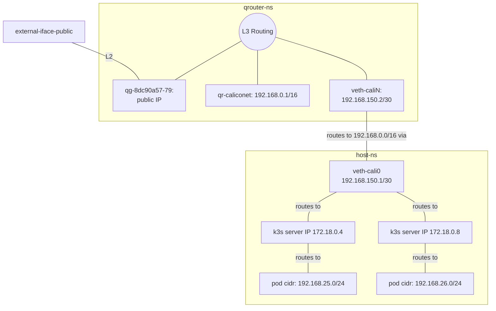

# chi@edge verification scenarios


## Basic operation

```
#globals.yml

enable_nova: false
enable_zun: true
enable_zun_compute: false
enable_zun_compute_k8s: true

enable_k3s: true
```

In this config, with nothing extra done, we only get 1 k3s server node, and no agents.

still need to create neutron public network
netron local calico net
bridge/route that to k3s calico network?

### with k3s in host NS

In our default config, with 1 public network, 1 "calico" network, and a neutron router connecting them, the default routing config in the router ns looks like:

```
default via 172.18.200.1 dev qg-8dc90a57-79 proto static 
172.18.200.0/24 dev qg-8dc90a57-79 proto kernel scope link src 172.18.200.41 
192.168.0.0/16 dev qr-3cee14a9-8b proto kernel scope link src 192.168.0.1 
```

What we do is add a veth-pair, `veth-cali0@veth-caliN`, and move `veth-caliN` into this router namespace.

```
sudo ip link add veth-cali0 type veth peer veth-caliN
sudo ip addr add 192.168.150.1/30 dev veth-cali0 
sudo ip link set veth-cali0 up

sudo ip link set veth-caliN  netns qrouter-c1056d17-4c5c-4c6d-bc56-9fd00e7040c4
sudo ip -n qrouter-c1056d17-4c5c-4c6d-bc56-9fd00e7040c4 addr add 192.168.150.2/30 dev veth-caliN
sudo ip -n qrouter-c1056d17-4c5c-4c6d-bc56-9fd00e7040c4 link set veth-caliN up
```

Now, we can ping both 192.168.150.1 and 192.168.150.2 from the host ns.
In the router NS, we can also ping both.

Finally, we modify the routes in the qrouter ns. Running `ip route replace 192.168.0.0/16 via 192.168.150.1` removes the old 192.168.0.0/16 route, now giving us:
```
default via 172.18.200.1 dev qg-8dc90a57-79 proto static 
172.18.200.0/24 dev qg-8dc90a57-79 proto kernel scope link src 172.18.200.41 
192.168.0.0/16 via 192.168.150.1 dev veth-caliN 
192.168.150.0/30 dev veth-caliN proto kernel scope link src 192.168.150.2
```

Now, when neutron sends traffic to addresses in 192.168.0.0/16 (both the neutron subnet cidr and the kubernetes cluster CIDR), it will first be sent to 192.168.150.1 in the host NS. From there, calico has set up routes 



